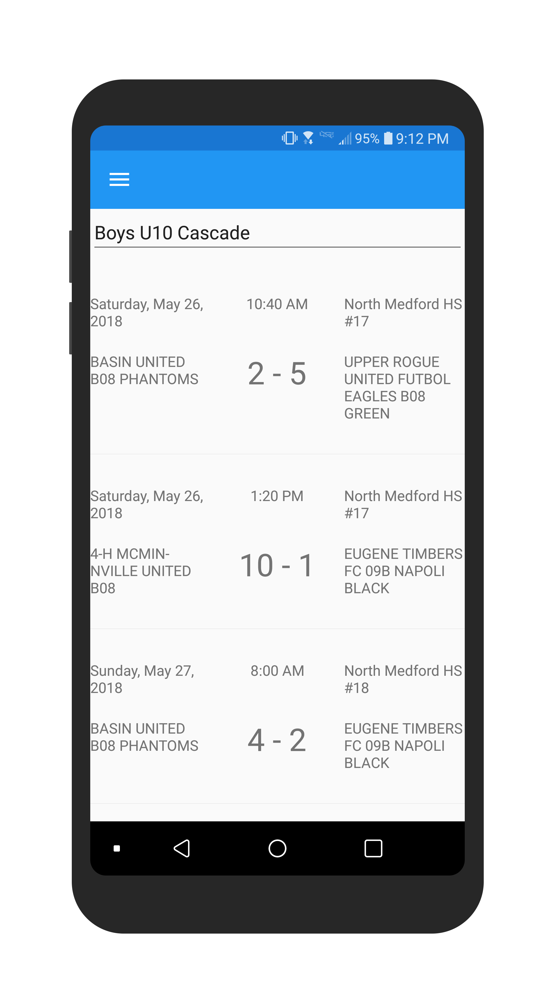

# TournamentBuddy
The Rogue Memorial Challenge is a soccer tournament held annually in Medford, OR. In 2018, over 150 teams from the Pacific Northwest ranging in age from U10 to U19 competed in the tournament.

The [event website](http://events.gotsport.com/events/schedule.aspx?EventID=64302) contains detailed information about teams, match schedules and results, however it is not designed for use on mobile device browsers. Tournament Buddy is a cross-platform application that scrapes data from the website and displays it in an easy to read format on both iOS and Android devices.

# Frameworks/Libraries Used
Tournament Buddy is written in C# using the [Xamarin.Forms](https://docs.microsoft.com/en-us/xamarin/xamarin-forms/) framework. This allows the application to compile for both iOS and Android from a single codebase.

[HTML Agility Pack](https://html-agility-pack.net/) was used to scrape data from the Rogue Memorial Challenge webpage.

Tournament Buddy stores the scraped data in a local [SQLite](https://www.sqlite.org/index.html) database.

# App Walkthrough
Tournament Buddy contains two primary pages:

**1. An "Age Groups" page** where matches are filtered by age group.

 

Users can select an age group using a platform-specific picker.

 

**2. A "Teams" page** where matches are filtered by team

 

Users can select teams using a platform-specific picker.

 

**A slide-out menu** is used to navigate between the "Age Groups" and "Teams" pages.

 

# Future Improvements
1. Team-tracking features that allow users to select teams as "favorites" and receive notifications when match scores are updated for their teams.
2. Detailed pages for individual matches that contain team statistics and a interactive map showing the location of the match.
